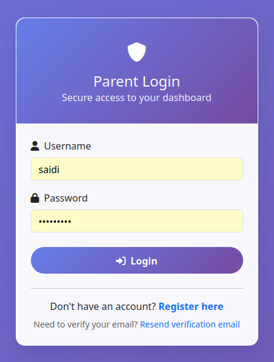
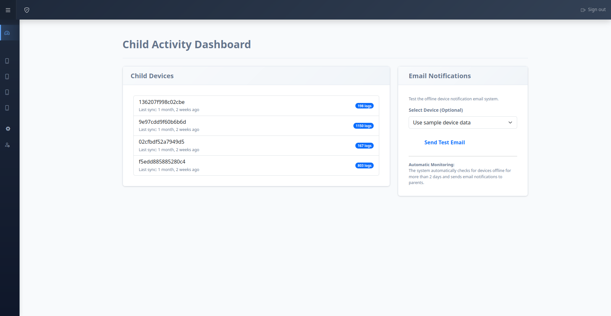

# Parental Control System - Web Management Platform


## Project Overview

The Parental Control System is a comprehensive solution designed to help parents monitor and manage their children's digital activities across devices. This repository contains the web management platform built with Django, which serves as the central control hub for the entire ecosystem.

This platform works in conjunction with the [Android Parental Control App](https://github.com/Raxan7/ParentalControl) to provide a complete solution for digital parenting.

## Parent Login Example



## Parental Dashboard Example



## Key Features

- **User-friendly Dashboard**: Intuitive interface for parents to monitor and manage screen time
- **Screen Time Management**: Set daily time limits for device usage
- **Bedtime Enforcement**: Schedule device downtime during sleeping hours
- **Content Filtering**: Block inappropriate websites and applications
- **Activity Monitoring**: Track app usage and browsing history
- **Multi-device Support**: Manage all family devices from a single dashboard
- **Real-time Synchronization**: Changes made on the dashboard immediately affect connected devices
- **Secure Authentication**: Role-based access with robust security measures

## Technology Stack

- **Backend**: Django (Python)
- **Database**: SQLite (development), PostgreSQL (production)
- **Frontend**: HTML, CSS, JavaScript, Bootstrap
- **API**: REST API for communication with mobile applications
- **Authentication**: JWT (JSON Web Tokens)
- **Deployment**: Docker, Render

## System Architecture


The system follows a client-server architecture:

1. **Web Platform (this repo)**: Central management dashboard for parents
2. **Mobile Application**: Android client that enforces rules on children's devices
3. **API Layer**: Secure communication between web platform and mobile clients
4. **Database**: Stores user profiles, device data, and configuration

## Getting Started

### Prerequisites

- Python 3.8+
- pip (Python package manager)
- virtualenv (recommended)
- Git

### Installation

1. Clone the repository:
   ```bash
   git clone https://github.com/Raxan7/ParentalControl.git
   cd parental_control_system
   ```

2. Create and activate a virtual environment:
   ```bash
   python -m venv venv
   source venv/bin/activate  # On Windows: venv\Scripts\activate
   ```

3. Install dependencies:
   ```bash
   pip install -r requirements.txt
   ```

4. Set up the database:
   ```bash
   python manage.py migrate
   ```

5. Create a superuser:
   ```bash
   python manage.py createsuperuser
   ```

6. Run the development server:
   ```bash
   python manage.py runserver
   ```

7. Access the admin interface at `http://127.0.0.1:8000/admin/`

### Environment Variables

Create a `.env` file in the project root with the following variables:

```
DEBUG=True
SECRET_KEY=your_secret_key_here
DATABASE_URL=sqlite:///db.sqlite3
ALLOWED_HOSTS=localhost,127.0.0.1
```

For production, adjust these settings accordingly.

## API Documentation

The system provides a RESTful API for mobile applications to:

- Authenticate users
- Sync screen time settings
- Report device usage
- Update content filtering rules
- Check for configuration changes

Complete API documentation is available at `/api/docs/` when running the server.

## Deployment

### Using Docker

1. Build the Docker image:
   ```bash
   docker build -t parental-control-system .
   ```

2. Run the container:
   ```bash
   docker run -p 8000:8000 parental-control-system
   ```

### Deploy to Render

Follow our [Render Deployment Guide](RENDER_DEPLOYMENT_GUIDE.md) for step-by-step instructions.

## Troubleshooting

### Database Migration Issues

If you encounter migration issues:

```bash
python manage.py migrate api 0013 --fake
```

See [DEPLOYMENT_FIX_README.md](DEPLOYMENT_FIX_README.md) for more troubleshooting steps.

## Project Structure

```
parental_control_system/
├── api/                  # API app for mobile integration
├── parent_ui/            # Web UI for parents
├── staticfiles/          # Static files
├── templates/            # HTML templates
├── docs/                 # Documentation
│   └── images/           # Images for documentation
├── parental_control_system/  # Core project settings
├── manage.py             # Django management script
├── requirements.txt      # Dependencies
└── README.md             # This file
```

## Development

### Running Tests

```bash
python manage.py test
```

### Code Style

We follow PEP 8 for Python code style. Before submitting PR, please run:

```bash
flake8 .
```

## Contributing

1. Fork the repository
2. Create a feature branch (`git checkout -b feature/amazing-feature`)
3. Commit your changes (`git commit -m 'Add some amazing feature'`)
4. Push to the branch (`git push origin feature/amazing-feature`)
5. Open a Pull Request

## Security

This application handles sensitive family data. If you discover any security issues, please email security@parentalcontrol.example.com instead of using the issue tracker.

## License

Distributed under the MIT License. See `LICENSE` for more information.

## Acknowledgements

- Django Project
- Bootstrap
- Font Awesome
- All contributors who have helped shape this project

## Contact

Project Link: [https://github.com/Raxan7/ParentalControl](https://github.com/Raxan7/ParentalControl)

---

© 2025 Parental Control System. All Rights Reserved.